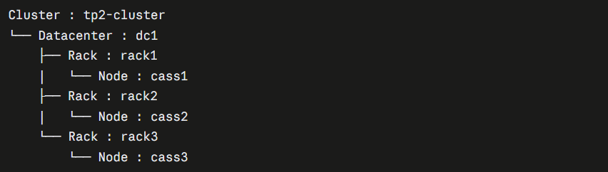
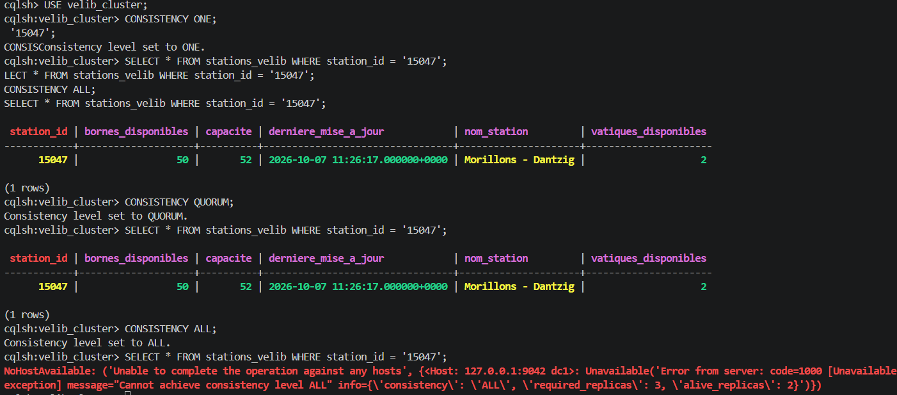
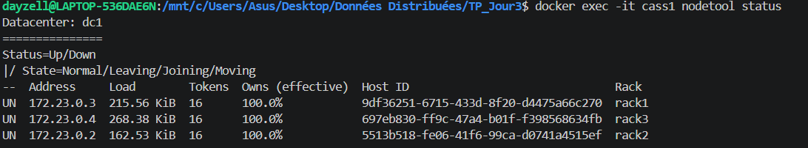
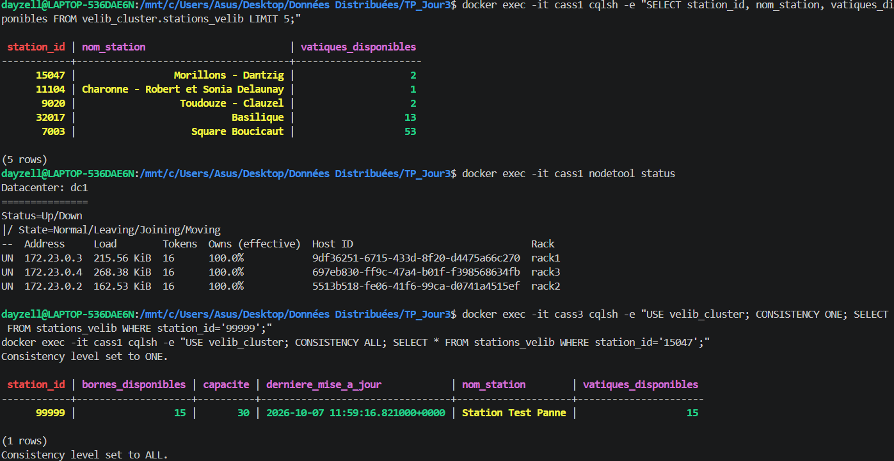

# TP — Données Distribuées : Cassandra avec réplication

*Cassandra à 3 nœuds : RF = 3, cohérence et panne d'un nœud*

**Auteur :** Joseph KEITA — M2 Big Data & IA

---

## 1. Mise en place du cluster

### Question 1

Après le démarrage des trois nœuds :

- **Combien de nœuds sont présents ?**
  > 3 nœuds sont présents

- **Dans quel datacenter sont-ils placés ?**
  > Ils sont dans le datacenter : dc1

- **Dans quels racks sont-ils placés ?**
  > Ils sont placés dans : rack1, rack2, rack3


---

## 2. Vérifier le cluster

### Question 2

**Présentez brièvement l'architecture obtenue.**



**Différence entre Cluster, Datacenter, Rack, Node :**

Chaque niveau contient le niveau inférieur. Un cluster est composé de datacenters, les datacenters sont composés de racks et les racks sont composés de nodes.

---

## 3. Table métier

### Question 3

- **Nom du keyspace :** velib_cluster
- **Nom de la table :** stations_velib, la disponibilité en temps réel des stations Vélib'
- **Principales colonnes :** station_id, nom_station, capacite, vatiques_disponibles, bornes_disponibles, derniere_mise_a_jour
- **Partition key :** station_id
- **Clustering key éventuelle :** aucune, une station = une ligne


---

## 4. Configuration de la réplication

### Question 4

**Que signifie RF = 3 pour une partition de la table métier ?**

> RF = 3 correspond à une réplication sur 3 nodes

**Différence entre partitionnement et réplication :**

- **Partitionnement :** répartir la donnée parmi plusieurs nodes
- **Réplication :** que les nodes soient similaires

---

## 5. Distribution des données

### Question 5

Chemin d'une donnée de la table métier :

- **Partition key :** station_id = '15047'
- **Hash :** Murmur3 appliqué à '15047'
- **Token :** -9181437804237570319, une position sur l'anneau
- **Nœud(s) responsable(s) :** le nœud qui possède cette plage de tokens
- **Réplicas :** avec RF = 3, une copie sur chaque nœud (cass1, cass2, cass3)

---

## 6. Niveaux de cohérence

Requêtes exécutées (3 nœuds en ligne) :

```sql
CONSISTENCY ONE;
SELECT * FROM stations_velib WHERE station_id = '15047';

CONSISTENCY QUORUM;
SELECT * FROM stations_velib WHERE station_id = '15047';

CONSISTENCY ALL;
SELECT * FROM stations_velib WHERE station_id = '15047';
```


### Question 6

**ONE** (1 réplica sur 3)

- Garantie : la réponse d'un seul réplica suffit, c'est le plus rapide, mais la donnée peut être ancienne.
- Disponibilité : maximale.
- En cas de panne : fonctionne tant qu'au moins 1 nœud est en ligne (jusqu'à 2 pannes tolérées).

**QUORUM** (2 réplicas sur 3)

- Garantie : la majorité des réplicas répond. Si les écritures sont aussi en QUORUM, la lecture renvoie la dernière valeur écrite.
- Disponibilité : bon compromis entre cohérence et disponibilité.
- En cas de panne : fonctionne avec 1 nœud en panne, échoue s'il y en a 2.

**ALL** (3 réplicas sur 3)

- Garantie : tous les réplicas répondent, c'est la cohérence la plus forte.
- Disponibilité : minimale.
- En cas de panne : échoue dès qu'un seul nœud est en panne (Unavailable).

---

## 7. Simulation d'une panne

```bash
docker stop cass3
```


### Question 7

- cass3 passe en **DN** (Down/Normal) : il est indisponible, mais il fait toujours partie du cluster.
- cass1 et cass2 restent **UN** (Up/Normal) : **2 nœuds sur 3 sont encore disponibles**.
- Chaque nœud possède toujours 100 % des données (RF = 3), donc toutes les stations restent accessibles sur cass1 et cass2.

---

## 8. Lectures pendant la panne



---

## 9. Redémarrage du nœud

```bash
docker start cass3
docker exec -it cass1 nodetool status
```


### Question 9

Oui, cass3 revient dans le cluster automatiquement après docker start, sans aucune reconfiguration.

Son nouvel état est UN : il passe de DN à UN, avec le même Host ID et le même rack (rack3). La lecture en ALL fonctionne de nouveau.

---

## 10. Vérification de la réplication après redémarrage





---

## 11. Synthèse

scénario 3 nœuds → RF = 3 → arrêt de cass3 → tests ONE / QUORUM / ALL → redémarrage → vérification_

### Question 11

**Pourquoi la réplication permet-elle à Cassandra de continuer à fonctionner lorsqu'un nœud tombe en panne ?**

Car la réplication permet que les 3 nodes soient identiques au niveau du contenu de leurs informations. Si une des nodes tombe en panne, les deux autres prennent le relais.
