# Compte rendu — Données distribuées : de Cassandra à Spark

*Cluster Cassandra à 3 nodes (RF = 3, cohérence, panne d'un node), puis traitement des données Vélib' avec PySpark*

**Auteur :** Joseph KEITA — M2 Big Data & IA

- [Partie I — Cluster Cassandra : réplication et tolérance aux pannes](#partie-i--cluster-cassandra--réplication-et-tolérance-aux-pannes)
- [Partie II — Mode de connexion entre Cassandra et Spark](#partie-ii--mode-de-connexion-entre-cassandra-et-spark)
- [Partie III — Traitement des données Vélib' avec Spark](#partie-iii--traitement-des-données-vélib-avec-spark)
- [Interprétation métier](#interprétation-métier)

---

# Partie I — Cluster Cassandra : réplication et tolérance aux pannes

## 1. Mise en place du cluster

Les nodes sont démarrés un par un (`docker compose up -d cass1`, puis `cass2`, puis `cass3`), en vérifiant l'état avec `nodetool status` entre chaque démarrage.

### Question 1

- **Combien de nodes sont présents ?**
  > 3 nodes sont présents.

- **Quel est leur état ?**
  > Les trois nodes sont **UN** (*Up / Normal*) : en ligne et intégrés à l'anneau.

- **Dans quel datacenter sont-ils placés ?**
  > Ils sont dans le datacenter `dc1`.

- **Dans quels racks sont-ils placés ?**
  > Un node par rack : cass1 dans `rack1`, cass2 dans `rack2`, cass3 dans `rack3`.

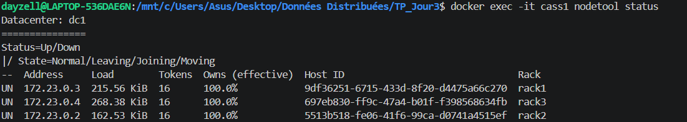

---

## 2. Vérifier le cluster

### Question 2

**Présentez brièvement l'architecture obtenue.**


Le cluster `tp2-cluster` contient un datacenter `dc1` de trois racks, avec un node par rack. Chaque node possède 16 tokens et `Owns (effective)` vaut 100 % pour chacun, car RF = 3 sur 3 nodes.

**Différence entre Cluster, Datacenter, Rack, Node :**

Chaque niveau contient le niveau inférieur :

- **Node** : une instance Cassandra (ici un conteneur) qui stocke une partie des données.
- **Rack** : un groupe de nodes qui partagent un même point de défaillance (baie, alimentation). Cassandra place les réplicas sur des racks différents.
- **Datacenter** : un ensemble de racks (un site physique ou logique). Le facteur de réplication est défini par datacenter.
- **Cluster** : l'ensemble des datacenters qui partagent le même anneau de tokens et le même nom.

---

## 3. Table métier

### Question 3

- **Nom du keyspace :** `velib_cluster`
- **Nom de la table :** `stations_velib`, la disponibilité en temps réel des stations Vélib'
- **Principales colonnes :** `station_id`, `nom_station`, `capacite`, `vatiques_disponibles`, `bornes_disponibles`, `derniere_mise_a_jour`
- **Partition key :** `station_id`
- **Clustering key éventuelle :** aucune, une station = une ligne

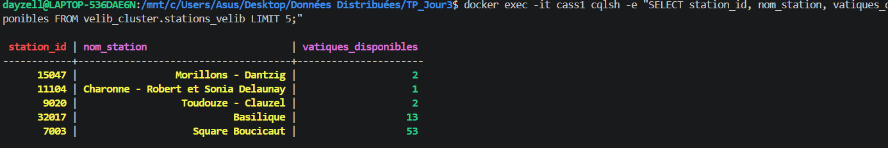

---

## 4. Configuration de la réplication

```sql
CREATE KEYSPACE velib_cluster
WITH replication = {'class': 'NetworkTopologyStrategy', 'dc1': 3};
```

### Question 4

**Que signifie RF = 3 pour une partition de la table métier ?**

> RF = 3 correspond à une réplication sur 3 nodes : chaque partition, donc chaque station (`station_id`), est stockée en **3 exemplaires** sur 3 nodes différents de `dc1`. Comme le cluster a exactement 3 nodes, chaque node possède une copie de toutes les stations.

**Différence entre partitionnement et réplication :**

- **Partitionnement :** répartir les données entre les nodes. Chaque partition est envoyée sur le node qui possède son token. Cela permet de stocker et de traiter plus de données (scalabilité).
- **Réplication :** copier chaque partition sur plusieurs nodes (ici 3). Cela permet de continuer à servir les données si un node tombe (disponibilité, tolérance aux pannes).

---

## 5. Distribution des données

### Question 5

Chemin d'une donnée de la table métier :

- **Partition key :** `station_id = '15047'`
- **Hash :** Murmur3 appliqué à `'15047'`
- **Token :** `-9181437804237570319`, une position sur l'anneau
- **Node(s) responsable(s) :** le node qui possède la plage de tokens contenant cette valeur
- **Réplicas :** avec RF = 3, une copie sur chaque node (cass1, cass2, cass3), vérifiable avec `nodetool getendpoints velib_cluster stations_velib 15047`

---

## 6. Niveaux de cohérence

Requêtes exécutées avec les 3 nodes en ligne :

```sql
CONSISTENCY ONE;
SELECT * FROM stations_velib WHERE station_id = '15047';

CONSISTENCY QUORUM;
SELECT * FROM stations_velib WHERE station_id = '15047';

CONSISTENCY ALL;
SELECT * FROM stations_velib WHERE station_id = '15047';
```

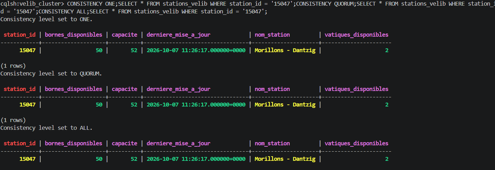

Les trois lectures renvoient la station `15047` (Morillons - Dantzig).

### Question 6

**ONE** (1 réplica sur 3)

- Garantie : la réponse d'un seul réplica suffit. C'est le plus rapide, mais la donnée peut être ancienne.
- Disponibilité : maximale.
- En cas de panne : fonctionne tant qu'au moins 1 node est en ligne (jusqu'à 2 pannes tolérées).

**QUORUM** (2 réplicas sur 3)

- Garantie : la majorité des réplicas répond. Si les écritures sont aussi en QUORUM, la lecture renvoie la dernière valeur écrite.
- Disponibilité : bon compromis entre cohérence et disponibilité.
- En cas de panne : fonctionne avec 1 node en panne, échoue s'il y en a 2.

**ALL** (3 réplicas sur 3)

- Garantie : tous les réplicas répondent. C'est la cohérence la plus forte.
- Disponibilité : minimale.
- En cas de panne : échoue dès qu'un seul node est en panne (`Unavailable`).

---

## 7. Simulation d'une panne

```bash
docker stop cass3
```

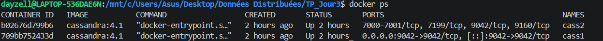


### Question 7

- cass3 passe en **DN** (*Down / Normal*) : il est indisponible, mais il fait toujours partie du cluster.
- cass1 et cass2 restent **UN** : **2 nodes sur 3 sont encore disponibles**.
- Chaque node possède toujours 100 % des données (RF = 3), donc toutes les stations restent accessibles sur cass1 et cass2.

---

## 8. Lectures pendant la panne


### Question 8

| Niveau | Réplicas nécessaires | Réplicas disponibles | Résultat |
|---|:---:|:---:|:---:|
| ONE | 1 | 2 | ✅ |
| QUORUM | 2 | 2 | ✅ |
| ALL | 3 | 2 | ❌ `Unavailable` |

- **ONE** et **QUORUM** fonctionnent : ils demandent 1 et 2 réponses, et cass1 et cass2 peuvent les fournir.
- **ALL** échoue : Cassandra renvoie `Cannot achieve consistency level ALL` avec `required_replicas: 3` et `alive_replicas: 2`.
- **Rôle de RF = 3 :** la station existe en 3 copies. Une copie est perdue avec cass3, mais il en reste 2, ce qui suffit pour ONE et QUORUM.

Une lecture réussit si **le nombre de réplicas disponibles est supérieur ou égal au nombre de réponses exigées par le niveau de cohérence**.

Pendant la panne, une station de test est aussi écrite en `QUORUM` :

```sql
INSERT INTO stations_velib (station_id, nom_station, capacite, bornes_disponibles, vatiques_disponibles, derniere_mise_a_jour)
VALUES ('99999', 'Station Test Panne', 30, 15, 15, toTimestamp(now()));
```

L'écriture réussit, car 2 réplicas sur 3 suffisent.

---

## 9. Redémarrage du node

```bash
docker start cass3
docker exec -it cass1 nodetool status
```

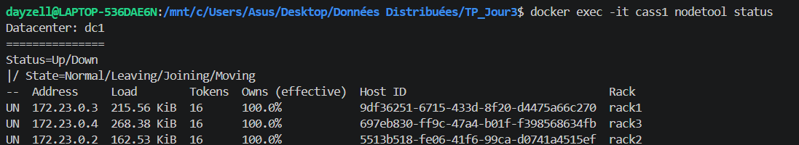

### Question 9

Oui, cass3 revient dans le cluster automatiquement après `docker start`, sans aucune reconfiguration.

Son nouvel état est **UN** : il passe de DN à UN, avec le même Host ID et le même rack (`rack3`). La lecture en ALL fonctionne de nouveau.

---

## 10. Vérification de la réplication après redémarrage


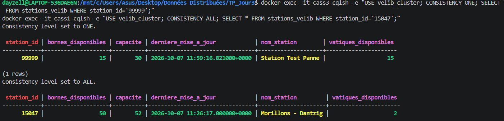

### Question 10

- La station `99999`, écrite pendant que cass3 était arrêté, est lue **directement sur cass3** en `ONE`.
- La lecture de `15047` en `ALL` fonctionne de nouveau : les 3 réplicas répondent.

cass3 a récupéré l'écriture manquée grâce au **hinted handoff** : pendant la panne, le coordinateur a gardé un « hint » pour cass3, puis l'a rejoué au redémarrage du node.

```text
Donnée (station 99999)
   ↓
Partition (station_id → token)
   ↓
Réplication (3 copies : cass1, cass2, cass3)
   ↓
Panne de cass3 → l'écriture en QUORUM réussit sur cass1 et cass2
   ↓
Données toujours accessibles en ONE et QUORUM
   ↓
Retour de cass3 → le hint est rejoué, cass3 est à jour
```

---

## 11. Synthèse

```text
3 nodes → RF = 3 → arrêt de cass3 → tests ONE / QUORUM / ALL → redémarrage → vérification
```

Le cluster démarre avec 3 nodes et le keyspace `velib_cluster` en RF = 3 : chaque station est copiée sur les trois nodes. À l'arrêt de cass3, il reste 2 nodes et donc 2 réplicas de chaque station. Les lectures en ONE et QUORUM fonctionnent, celle en ALL échoue, et une écriture en QUORUM reste possible. Au redémarrage, cass3 revient en UN, récupère l'écriture manquée et la lecture en ALL fonctionne de nouveau.

### Question 11

**Pourquoi la réplication permet-elle à Cassandra de continuer à fonctionner lorsqu'un node tombe en panne ?**

Parce que chaque donnée existe sur plusieurs nodes. Si un node tombe, les autres réplicas répondent à sa place. Tant que le nombre de réplicas disponibles reste suffisant pour le niveau de cohérence demandé (2 pour QUORUM), le cluster continue de lire et d'écrire. Le node en panne est ensuite resynchronisé à son retour (hinted handoff, et `nodetool repair` si besoin).

---

# Partie II — Mode de connexion entre Cassandra et Spark

## 1. Environnement Spark

Spark tourne dans un conteneur Docker séparé, `spark-tp1`, basé sur l'image `quay.io/jupyter/pyspark-notebook` (Jupyter + Python + Spark). Il a été lancé comme dans le guide :

```bash
docker run -d --name spark-tp1 \
  -p 8888:8888 -p 4040-4045:4040-4045 \
  -e JUPYTER_TOKEN=spark \
  -v "$(pwd)":/home/jovyan/work \
  quay.io/jupyter/pyspark-notebook
```

| Élément | Valeur |
|---|---|
| Version de Spark | 4.2.0 |
| Mode | `local[4]` : le driver et les executors tournent dans le même processus, avec 4 threads |
| Parallélisme par défaut | 4 |
| `spark.sql.shuffle.partitions` | 4 (au lieu de 200, adapté à un petit jeu de données) |
| Jupyter | http://localhost:8888/?token=spark |
| Spark UI | http://localhost:4040 (puis 4041, 4042… pour chaque SparkSession supplémentaire) |

La plage de ports 4040-4045 est publiée parce que chaque notebook ouvert crée sa propre SparkSession, et chacune prend le port libre suivant.

## 2. Mise en réseau : le pont `cass-net`

Au lancement, `spark-tp1` n'est relié qu'au réseau `bridge` par défaut de Docker. Il ne voit donc pas les nodes Cassandra, qui sont sur le réseau `cass-net` créé par le `docker-compose.yaml`.

On relie le conteneur Spark au réseau du cluster :

```bash
docker network connect cass-net spark-tp1
```

Le conteneur reçoit alors une seconde interface réseau sur `cass-net`. On le vérifie avec :

```bash
docker network inspect cass-net \
  --format '{{range .Containers}}{{.Name}} -> {{.IPv4Address}}{{"\n"}}{{end}}'
```

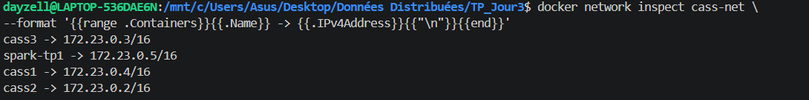

| Conteneur | Adresse sur `cass-net` |
|---|---|
| cass1 | 172.23.0.4 |
| cass2 | 172.23.0.2 |
| cass3 | 172.23.0.3 |
| spark-tp1 | 172.23.0.5 |

Sur un même réseau Docker, le **DNS interne de Docker** résout les noms de conteneurs : depuis le notebook, `cass1` est résolu en `172.23.0.4`. On peut donc écrire `Cluster(["cass1"])` sans connaître l'adresse IP, qui peut d'ailleurs changer d'un redémarrage à l'autre.

Le cluster est vérifié avant de lancer Spark :

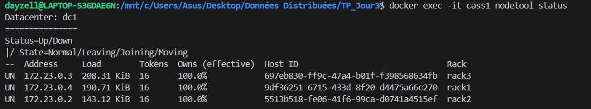

> Dans le `docker-compose.yaml` du dépôt, le service `spark` est déclaré directement sur `cass-net`. Avec `docker compose up -d spark`, l'étape `docker network connect` n'est plus nécessaire.

## 3. Connexion depuis le notebook

La connexion utilise le driver Python officiel de Cassandra, `cassandra-driver` (3.30.1), installé dans le notebook :

```python
%pip install cassandra-driver

from cassandra.cluster import Cluster

cluster = Cluster(["cass1"])     # point de contact, port 9042 (protocole CQL natif)
session = cluster.connect()
session.set_keyspace("velib_cluster")
```

Le fonctionnement est le suivant :

1. Le driver ouvre une connexion vers le **point de contact** `cass1` sur le port 9042.
2. Il lit les tables système (`system.local`, `system.peers`) et **découvre tout l'anneau**. Une vérification depuis `spark-tp1` liste bien les 3 nodes : `172.23.0.4` (rack1), `172.23.0.2` (rack2), `172.23.0.3` (rack3), tous `up`.
3. Les requêtes sont ensuite réparties avec la politique `TokenAwarePolicy(DCAwareRoundRobinPolicy)` : chaque requête est envoyée de préférence à un node qui possède la partition demandée.
4. Le niveau de cohérence par défaut du driver est **`LOCAL_ONE`** : une lecture depuis Spark réussit tant qu'un réplica de `dc1` répond. C'est le même mécanisme que dans la Partie I.

Comme `spark-tp1` est sur `cass-net`, le driver peut joindre directement les trois nodes. Depuis la machine hôte (script `import_velib.py`), seul cass1 est accessible, par le port 9042 publié.

La connexion est validée en listant les keyspaces (`velib_cluster` apparaît) puis la structure de la table :

```text
bornes_disponibles -> int
capacite -> int
derniere_mise_a_jour -> timestamp
nom_station -> text
station_id -> text
vatiques_disponibles -> int
```

## 4. Passage de Cassandra à un DataFrame Spark

```python
rows = session.execute("SELECT * FROM stations_velib")
columns = rows.column_names
data = [tuple(row) for row in rows]          # lignes Cassandra → liste Python

df = spark.createDataFrame(data, columns)    # liste Python → DataFrame Spark
```

1. `session.execute` lit toute la table **depuis le driver Spark**, en une seule requête CQL.
2. Les lignes sont converties en une liste de tuples Python, en mémoire.
3. `spark.createDataFrame` parallélise cette liste : elle est découpée en `defaultParallelism` = **4 partitions Spark**, sur lesquelles les tâches travaillent ensuite en parallèle.

```text
cass1 / cass2 / cass3  (keyspace velib_cluster, table stations_velib, RF = 3)
        │  CQL, port 9042, réseau cass-net, cohérence LOCAL_ONE
        ▼
cassandra-driver (dans le notebook = driver Spark)
        │  liste de 22 tuples Python
        ▼
spark.createDataFrame(data, columns)
        │  4 partitions Spark (local[4])
        ▼
Transformations → Actions → Spark UI (localhost:4040)
```

## 5. Limites de ce mode et alternative

Ce mode de connexion est simple et suffit pour 22 stations. En revanche, **la lecture n'est pas distribuée** : tout passe par le driver Spark, qui doit tenir la table entière en mémoire. Les partitions Spark ne sont que des tranches de la liste Python, sans lien avec les partitions Cassandra. Les types sont aussi déduits des valeurs Python : les colonnes `int` de Cassandra deviennent des `long` dans Spark, sauf si l'on fournit un schéma explicite (`StructType`).

Pour de gros volumes, on utiliserait le **Spark Cassandra Connector** (DataStax), avec une version compatible avec celle de Spark :

```python
spark = (SparkSession.builder
    .config("spark.jars.packages", "com.datastax.spark:spark-cassandra-connector_2.13:<version>")
    .config("spark.cassandra.connection.host", "cass1")
    .getOrCreate())

df = (spark.read.format("org.apache.spark.sql.cassandra")
    .options(keyspace="velib_cluster", table="stations_velib")
    .load())
```

| | `cassandra-driver` + `createDataFrame` (utilisé) | Spark Cassandra Connector |
|---|---|---|
| Lecture | une requête, par le driver Spark | en parallèle par les executors, par plages de tokens |
| Partitions Spark | tranches d'une liste Python | construites à partir des plages de tokens Cassandra |
| Volume adapté | petit (doit tenir en mémoire) | gros volumes |
| Schéma | déduit des valeurs Python (`int` → `long`) | lu depuis le schéma CQL |
| Filtres | appliqués après la lecture | poussés vers Cassandra quand c'est possible |
| Installation | `pip install cassandra-driver` | package JVM ajouté à Spark |

---

# Partie III — Traitement des données Vélib' avec Spark

Le notebook complet, exécuté, est [`notebook/tp4_cassandra_spark.ipynb`](../notebook/tp4_cassandra_spark.ipynb). Les manipulations de découverte de Spark sont dans [`notebook/tp1_decouverte_spark.ipynb`](../notebook/tp1_decouverte_spark.ipynb).

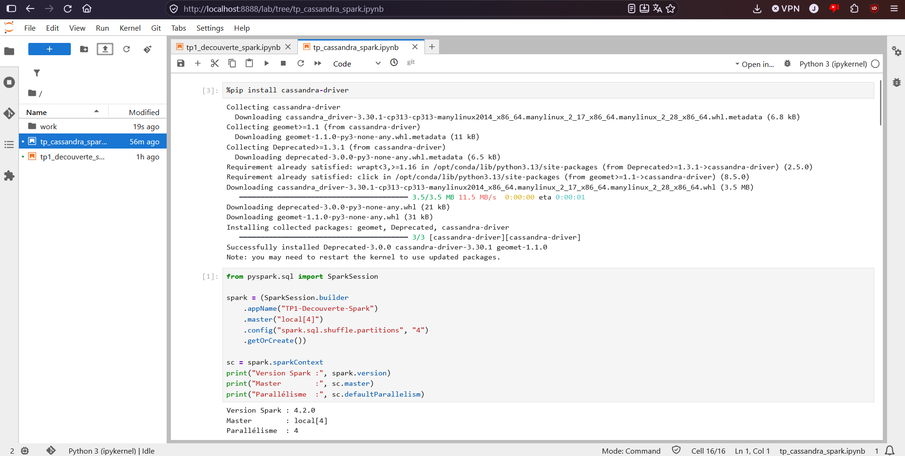

## 1. Données utilisées

- **Keyspace / table :** `velib_cluster.stations_velib`, la table métier de la Partie I.
- **Volume :** 22 lignes lues dans Cassandra, et 22 lignes dans le DataFrame (`df.count()`). Ce sont 20 stations importées depuis l'API Vélib' et les 2 stations de test `99999` et `99998` écrites pendant les tests de panne. Ces 2 lignes sont **exclues de l'analyse métier** : il reste 20 stations réelles.
- **Colonnes importantes :** `capacite`, `vatiques_disponibles` (vélos disponibles) et `bornes_disponibles` (places libres), avec `station_id` et `nom_station` pour identifier la station.
- **Information métier analysée :** la disponibilité des vélos par station, pour repérer les stations **en tension** : presque vides (on ne trouve pas de vélo) ou presque pleines (on ne peut pas rendre son vélo).

Schéma du DataFrame :

```text
root
 |-- station_id: string (nullable = true)
 |-- bornes_disponibles: long (nullable = true)
 |-- capacite: long (nullable = true)
 |-- derniere_mise_a_jour: timestamp (nullable = true)
 |-- nom_station: string (nullable = true)
 |-- vatiques_disponibles: long (nullable = true)
```

## 2. Transformations

**Sélection** des colonnes utiles :

```python
df.select("station_id", "nom_station", "capacite", "vatiques_disponibles", "bornes_disponibles")
```

**Filtre 1 : stations presque vides** (`vatiques_disponibles < 5`), 4 stations :

| station_id | nom_station | capacite | vélos | bornes libres |
|---|---|---:|---:|---:|
| 15047 | Morillons - Dantzig | 52 | 2 | 50 |
| 11104 | Charonne - Robert et Sonia Delaunay | 20 | 1 | 19 |
| 9020 | Toudouze - Clauzel | 21 | 2 | 19 |
| 6108 | Saint-Romain - Cherche-Midi | 17 | 2 | 14 |

**Filtre 2 : stations très remplies** (`vatiques_disponibles > 20`), 3 stations :

| station_id | nom_station | capacite | vélos | bornes libres |
|---|---|---:|---:|---:|
| 7003 | Square Boucicaut | 60 | 53 | 6 |
| 17026 | Jouffroy d'Abbans - Wagram | 40 | 21 | 18 |
| 13101 | Croulebarde - Corvisart | 34 | 28 | 6 |

**Colonne calculée : taux de disponibilité**

```python
STATIONS_TEST = ["99999", "99998"]
df_metier = df.filter(~F.col("station_id").isin(STATIONS_TEST))

df_taux = df_metier.withColumn(
    "taux_disponibilite",
    F.when(F.col("capacite") > 0,
           F.round(F.col("vatiques_disponibles") / F.col("capacite") * 100, 1))
     .otherwise(None)
)
```

`taux_disponibilite` est la part des places de la station occupées par un vélo disponible : proche de 0 %, la station est vide ; proche de 100 %, elle est pleine. Ce taux permet de comparer des stations de tailles différentes. 2 vélos ne veulent pas dire la même chose pour une station de 17 places et pour une station de 52 places.

| Les plus vides | taux | | Les plus pleines | taux |
|---|---:|---|---|---:|
| Morillons - Dantzig (2/52) | 3,8 % | | Messine - Place du Pérou (12/12) | 100,0 % |
| Charonne - R. et S. Delaunay (1/20) | 5,0 % | | Square Boucicaut (53/60) | 88,3 % |
| Toudouze - Clauzel (2/21) | 9,5 % | | Croulebarde - Corvisart (28/34) | 82,4 % |

## 3. Actions et agrégations

- **Action d'affichage :** `show()` sur chaque résultat
- **Action de comptage :** `df.count()` → 22 lignes, `df_taux.count()` → 20 stations réelles

**Statistiques globales** (`min`, `max`, `avg`, `sum`) :

| nb_stations | places | vélos | bornes libres | minimum | maximum | moyenne | taux moyen |
|---:|---:|---:|---:|---:|---:|---:|---:|
| 20 | 647 | 259 | 361 | 1 | 53 | 13,0 | 39,8 % |

**Agrégation avec `groupBy`** : nombre de stations par niveau de vélos disponibles (Faible < 5, Moyenne 5 à 15, Forte > 15) :

```python
(df_categorie
    .groupBy("categorie")
    .agg(F.count("*").alias("nb_stations"),
         F.round(F.avg("vatiques_disponibles"), 1).alias("velos_moyens"),
         F.round(F.avg("taux_disponibilite"), 1).alias("taux_moyen"))
    .orderBy(F.desc("nb_stations"))
    .show())
```

| categorie | nb_stations | vélos moyens | taux moyen |
|---|---:|---:|---:|
| Moyenne | 10 | 9,8 | 39,1 % |
| Forte | 6 | 25,7 | 62,5 % |
| Faible | 4 | 1,8 | 7,5 % |

## 4. Partitions et Lazy Evaluation

**Partitions :**

```text
Nombre de partitions initiales : 4
Nombre de partitions après repartition(4) : 4
Nombre de partitions après repartition(2) : 2
Lignes par partition (df)  : [5, 5, 5, 7]
Lignes par partition (df2) : [11, 11]
```

- Le DataFrame a **4 partitions**, car `createDataFrame` découpe la liste Python selon le parallélisme par défaut (`local[4]` = 4). Les 22 lignes sont réparties en 5, 5, 5 et 7.
- `repartition(4)` garde 4 partitions, mais redistribue toutes les lignes (shuffle). `repartition(2)` change réellement leur nombre : 2 partitions de 11 lignes. Chaque partition sera traitée par une task.
- Une **partition Spark** (une tranche du DataFrame, traitée par une task) n'est pas la même chose qu'une **partition Cassandra** (les lignes d'une même `station_id`, placées sur un node selon leur token).

**Lazy Evaluation :**

```python
result = (
    df
    .filter(F.col("vatiques_disponibles") > 5)                    # transformation
    .select("station_id", "nom_station", "vatiques_disponibles")  # transformation
    .orderBy(F.desc("vatiques_disponibles"))                      # transformation
)
# → « Le plan logique est construit, mais aucun calcul n'a été exécuté. »

result.show(10)                                                   # action → exécution
```

La cellule qui définit `result` s'exécute instantanément et ne crée aucun Job. Seul `result.show(10)` lance le calcul et affiche les stations triées, de Square Boucicaut (53 vélos) à Basilique (13).

```text
filter → select → orderBy → show(10) → Job Spark
```

**Pourquoi Spark utilise-t-il la Lazy Evaluation ?**

> En attendant l'action, Spark connaît toute la chaîne de transformations (le DAG) avant de calculer. L'optimiseur Catalyst peut alors optimiser le plan complet : appliquer les filtres le plus tôt possible, ne garder que les colonnes utiles, et regrouper les transformations étroites (`filter`, `select`) dans un même stage sans résultat intermédiaire. Rien n'est calculé si aucune action ne le demande. Le DAG sert aussi de **lignage** : si une partition est perdue, Spark sait la recalculer. C'est la tolérance aux pannes côté calcul, comme la réplication l'est côté stockage dans Cassandra.

On le voit dans le plan optimisé du `groupBy` ci-dessous : Catalyst a supprimé le calcul de `taux_disponibilite`, inutile pour compter les catégories, et ne garde que `vatiques_disponibles` pour calculer la catégorie.

## 5. Shuffle et Spark UI

**Plan d'exécution** de `df_categorie.groupBy("categorie").count().explain(True)` (plan physique) :

```text
AdaptiveSparkPlan isFinalPlan=false
+- HashAggregate(keys=[categorie#190], functions=[count(1)])
   +- Exchange hashpartitioning(categorie#190, 4), ENSURE_REQUIREMENTS
      +- HashAggregate(keys=[categorie#190], functions=[partial_count(1)])
         +- Project [CASE WHEN (vatiques_disponibles#5L < 5) THEN Faible ... END AS categorie#190]
            +- Filter NOT station_id#0 IN (99999,99998)
               +- Scan ExistingRDD[...]
```

- **`Exchange hashpartitioning(categorie, 4)`** est le **shuffle** : les lignes de la même catégorie sont envoyées dans la même partition, parmi les 4 partitions de `spark.sql.shuffle.partitions`.
- L'agrégation se fait en deux temps : un comptage partiel dans chaque partition (`partial_count`) avant le shuffle, puis le comptage final après. Seuls les résultats partiels traversent le shuffle.
- **`Scan ExistingRDD`** : Spark lit une collection déjà en mémoire, et non Cassandra. C'est la conséquence du mode de connexion par `createDataFrame` (Partie II).

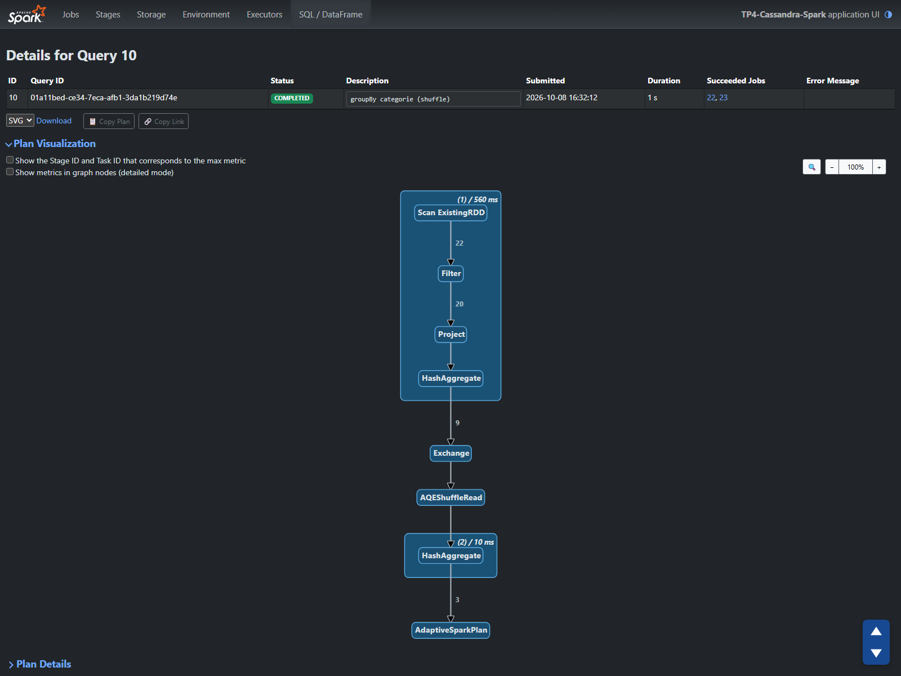

Le plan de la requête dans la Spark UI donne les volumes à chaque étape : **22 lignes lues → 20 après le filtre → 9 résultats partiels envoyés dans le shuffle → 3 catégories**. Les 9 résultats partiels correspondent à 4 partitions qui contiennent chacune 2 ou 3 catégories.

**Jobs, Stages et Tasks.** L'agrégation est lancée avec la description `groupBy categorie (shuffle)` pour la retrouver dans la Spark UI (port 4042 ici, car 4040 et 4041 étaient déjà pris par d'autres sessions) :

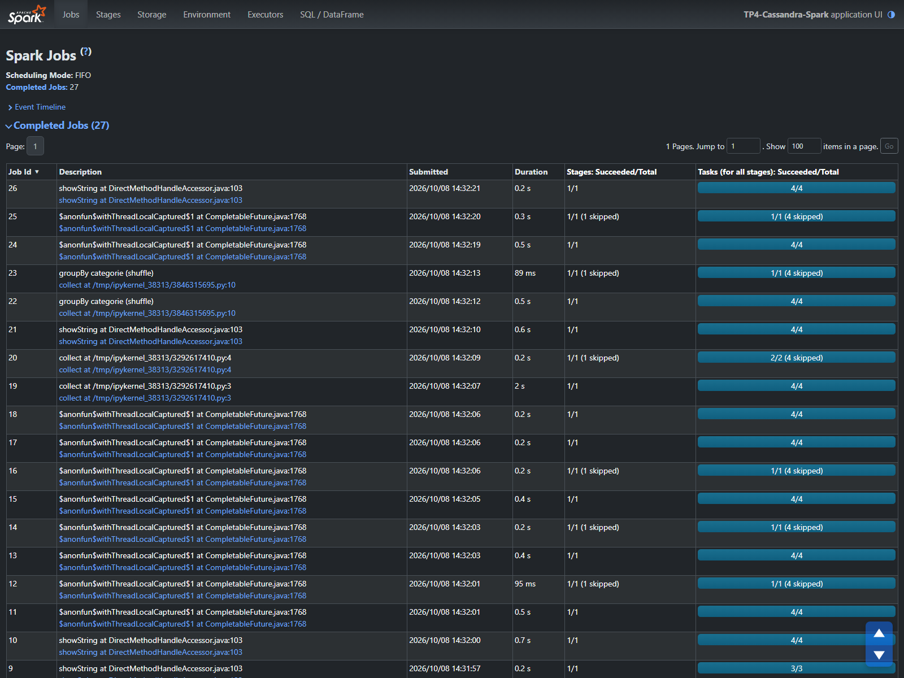

| Job | Stage | Rôle | Tasks | Shuffle Write | Shuffle Read | Durée |
|---|---|---|---:|---:|---:|---:|
| 22 | 27 | comptage partiel dans chaque partition | 4 | 392 o (9 lignes) | — | 0,5 s |
| 23 | 29 | lecture du shuffle et comptage final | 1 | — | 392 o | 71 ms |
| 23 | 28 | stage 27 réutilisé | 0/4 (*skipped*) | — | — | — |

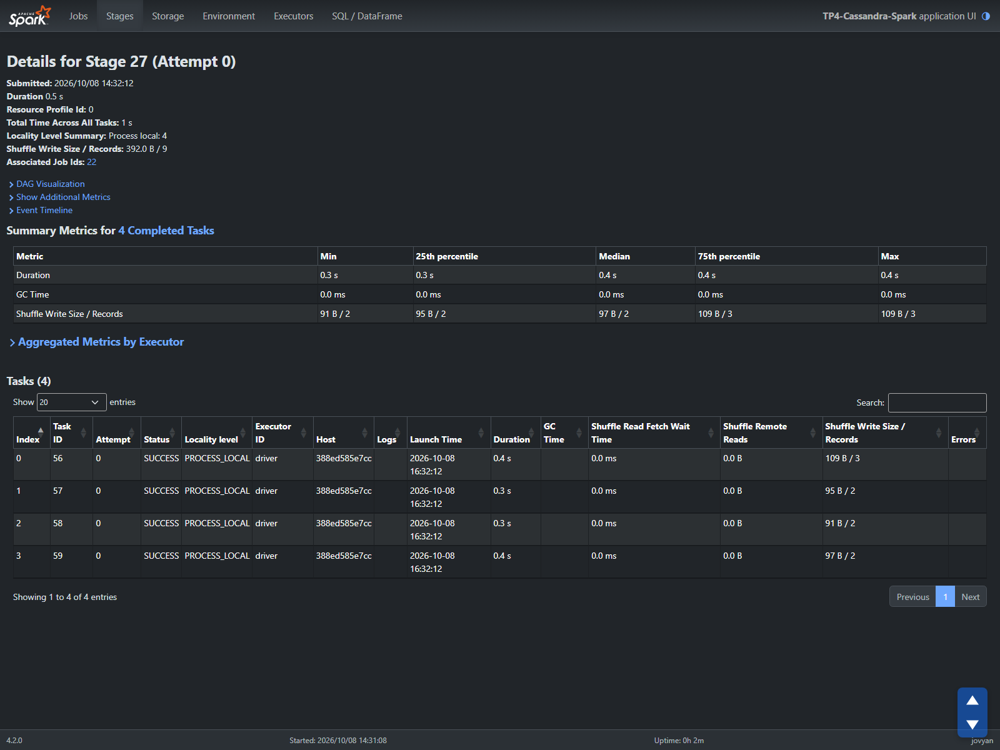

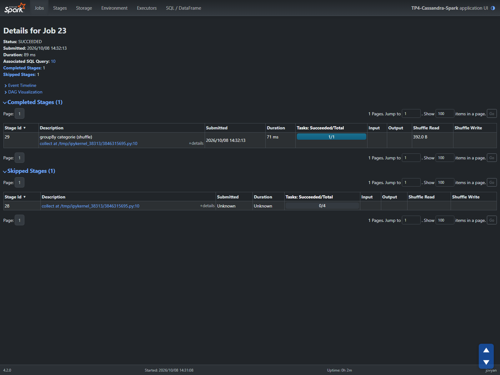

- Le shuffle **coupe le traitement en deux stages** : avant l'`Exchange`, une task par partition (4) ; après, une seule task. L'Adaptive Query Execution a regroupé les 4 partitions de shuffle en une, car il n'y a que 392 octets à lire.
- **Shuffle Write = Shuffle Read = 392 octets** : ce que les 4 tasks du stage 27 écrivent est exactement ce que lit la task du stage 29.
- Le stage 28 est marqué *skipped* : c'est le même calcul que le stage 27, et Spark réutilise ses fichiers de shuffle au lieu de le refaire.
- Sur l'ensemble du notebook, la Spark UI compte **27 Jobs**, **27 stages exécutés et 7 skipped**. Chaque `show`, `count` ou `collect` crée au moins un Job, et chaque `groupBy` ou `orderBy` ajoute un stage de shuffle.

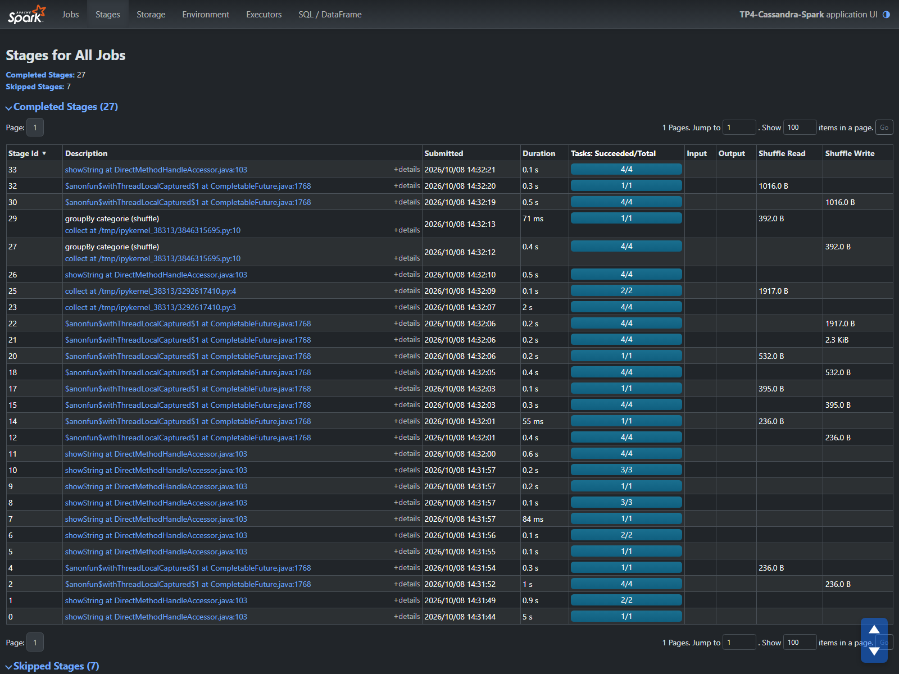

La première capture de la Spark UI, prise sur le notebook de découverte, montre le même schéma sur `spark.range(..., 8)` : 8 tasks avant le shuffle, puis `1/1 (8 skipped)` après.

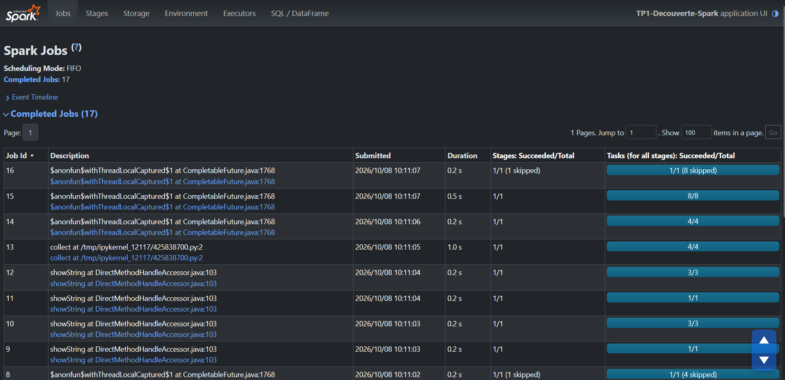

## 6. Analyse métier

**Question :** quelles stations sont en tension (risque d'être vides ou pleines), et combien de vélos faudrait-il déplacer ?

Seuils retenus sur le taux de disponibilité : **< 20 %** → risque vide, **> 80 %** → risque plein, sinon équilibrée.

```text
Lecture Cassandra (session.execute)
      ↓
DataFrame Spark (createDataFrame)
      ↓
Sélection (station_id, nom_station, capacite, vatiques_disponibles, bornes_disponibles)
      ↓
Filtre (stations réelles, capacité > 0)
      ↓
Colonnes calculées (taux_disponibilite, niveau_tension)
      ↓
Agrégation (groupBy niveau_tension : count, sum, avg)
      ↓
Action (show) → seule étape qui déclenche le calcul
      ↓
Spark UI (Jobs, Stages, Exchange, Shuffle Read / Write)
```

| niveau_tension | stations | places | vélos | bornes libres | taux moyen |
|---|---:|---:|---:|---:|---:|
| Risque vide | 6 | 188 | 17 | 166 | 9,3 % |
| Équilibrée | 11 | 353 | 149 | 183 | 42,7 % |
| Risque plein | 3 | 106 | 93 | 12 | 90,2 % |

Stations à rééquilibrer en priorité :

| Station | capacité | vélos | bornes libres | taux | niveau |
|---|---:|---:|---:|---:|---|
| Morillons - Dantzig | 52 | 2 | 50 | 3,8 % | Risque vide |
| Charonne - Robert et Sonia Delaunay | 20 | 1 | 19 | 5,0 % | Risque vide |
| Toudouze - Clauzel | 21 | 2 | 19 | 9,5 % | Risque vide |
| Saint-Romain - Cherche-Midi | 17 | 2 | 14 | 11,8 % | Risque vide |
| Porte de Saint-Ouen - Bessières | 42 | 5 | 37 | 11,9 % | Risque vide |
| Guersant - Gouvion-Saint-Cyr | 36 | 5 | 27 | 13,9 % | Risque vide |
| Croulebarde - Corvisart | 34 | 28 | 6 | 82,4 % | Risque plein |
| Square Boucicaut | 60 | 53 | 6 | 88,3 % | Risque plein |
| Messine - Place du Pérou | 12 | 12 | 0 | 100,0 % | Risque plein |

**Justification des choix :**

- **Données :** `stations_velib` est la table métier du projet et contient tout ce qu'il faut pour mesurer la disponibilité : la capacité, les vélos et les bornes libres.
- **Transformations :** le filtre retire les stations de test, qui fausseraient les totaux. Le taux rend comparables des stations de tailles différentes, et le niveau de tension traduit ce taux en décision : apporter des vélos, en retirer, ou ne rien faire.
- **Agrégation :** le `groupBy` par niveau de tension dit combien de stations et combien de vélos sont concernés. C'est l'information utile pour dimensionner une tournée de régulation.
- **Exécution :** seule l'action `show()` lance le calcul. Tout ce qui précède construit seulement le plan.

---

## Interprétation métier

- Le réseau n'est pas en pénurie : 259 vélos pour 647 places (taux moyen de 40 %) et 361 bornes libres. Le problème vient de la **répartition** des vélos, pas de leur nombre.
- 6 stations sur 20 risquent d'être vides : elles n'offrent que 17 vélos pour 188 places (9 %). Morillons - Dantzig n'a plus que 2 vélos pour 52 places.
- 3 stations sont presque pleines (90 % en moyenne, 12 bornes libres au total). Messine - Place du Pérou n'a plus aucune borne : les usagers ne peuvent pas y rendre leur vélo.
- Il faudrait apporter environ 24 vélos aux 6 stations vides pour les remonter à 20 %. 9 de ces vélos peuvent venir des 3 stations pleines, ce qui les ramènerait sous 80 %.
- Ces chiffres sont une photo de 20 stations à un instant donné (7 octobre, vers 11 h 30). Il faudrait des relevés réguliers sur tout le réseau pour confirmer ces tendances.
